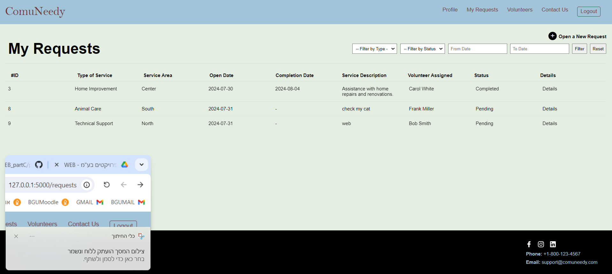

# WEB course 2024 Part C
## Group 18 - Afik Dadon, Karin Knaani
### ComuNeedy Web Application

### Project Overview
ComuNeedy is a web application designed to connect volunteers with individuals seeking various services. The platform allows service applicants to submit requests and receive support from suitable volunteers. The site includes features for user registration, request management, and feedback submission, ensuring an efficient and user-friendly experience for those seeking help. Please note that the website is intended for service requesters only. Therefore, some actions performed by volunteers, such as closing an application, are not described on the website.

### Order of Operations
1. **Homepage**
   - Users land on the homepage, which welcomes them and provides information about ComuNeedy. Registered users see a personalized greeting.
   - **Action:** Guest users can click "Join Us Today" to register.

2. **Registration**
   - New users fill out a registration form with personal details and account credentials.
   - **Action:** After registration, users are redirected to the Sign In page.

3. **Sign In**
   - Registered users enter their credentials to access their account.
   - **Action:** Users who forget their password can click "Forgot password?" to reset it.

4. **Forgot Password**
   - Users provide their email and elementary school details to initiate the password reset process.
   - **Action:** If details match, users are redirected to the Password Reset page.

5. **Password Reset**
   - Users enter a new password to reset their account credentials.
   - **Action:** After resetting, users are redirected to the Sign In page.

6. **Profile**
   - Logged-in users view and manage their personal information.
   - **Action:** Users can click "Edit Profile" to update their details.

7. **Edit Profile**
   - Users update their personal information and save changes.
   - **Action:** After saving, users return to the Profile page.

8. **Requests**
   - Users view their request history and can filter requests based on various criteria.
   - **Action:** Users can create a new request or view details of existing requests.

9. **New Request**
   - Users fill out a form to submit a new service request.
   - **Action:** After submission, users are redirected back to the Requests page.

10. **Request Details**
    - Users view detailed information about a specific request.
    - **Action:** For completed requests, users can write a review.

11. **Service Feedback**
    - Users provide feedback and rate the volunteer who assisted them.
    - **Action:** After submitting feedback, users are redirected to the Homepage.

12. **Volunteers**
    - Users browse and filter a list of volunteers based on various criteria.
    - **Action:** Users can view more details about individual volunteers.

13. **Volunteer Profile**
    - Users view detailed information about a specific volunteer, including personal details, service details, and reviews.

### Features
Below are screenshots of the various pages in the ComuNeedy application:

- **Homepage**
  - 
  - *Description:* The main landing page showing different content for guests and logged-in users.

- **Registration Page**
  - 
  - *Description:* Form for new users to create an account.

- **Sign In Page**
  - 
  - *Description:* Login page for existing users.

- **Forgot Password Page**
  - 
  - *Description:* Page for users to recover their password.

- **Password Reset Page**
  - 
  - *Description:* Page to set a new password.

- **Profile Page**
  - 
  - *Description:* User’s personal information page.

- **Edit Profile Page**
  - 
  - *Description:* Form for updating user details.

- **Requests Page**
  - 
  - *Description:* Overview of all user requests with filtering options.

- **New Request Page**
  - 
  - *Description:* Form for submitting a new service request.

- **Request Details Page**
  - 
  - *Description:* Detailed view of a specific request.

- **Service Feedback Page**
  - 
  - *Description:* Page for submitting feedback on volunteer services.

- **Volunteers Page**
  - 
  - *Description:* List of volunteers with filtering options.

- **Volunteer Profile Page**
  - 
  - *Description:* Detailed view of a volunteer’s profile.

*Note: The images are at 75% resolution so that the pages are displayed properly.*

